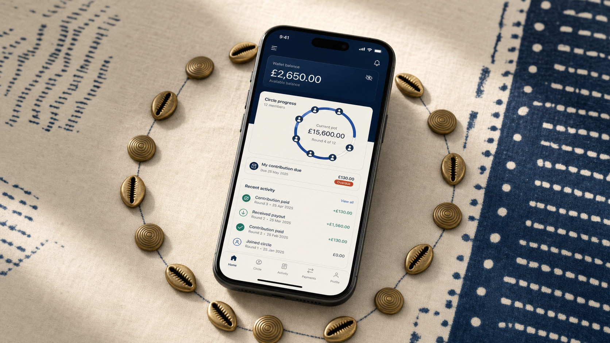

# Àjọ Frontend



Àjọ is a mobile-first web app for digital esusu: rotating savings circles with clear wallet balances, verifiable draw order, ledger-backed money movement, and honest settlement states.

The visual direction follows `AJO-DES-001`: adire indigo grounds, calico canvas, cowrie brass emphasis, and a reusable circle/ring motif for contribution progress and payout order.

This frontend is initialized as a minimal TanStack Start app with TanStack Router, React Query, React 19, Vite, and one starter route.

```bash
npm install
npm run dev
```

Edit `src/routes/index.tsx` to get started. Add route files under
`src/routes`; TanStack Router updates `src/routeTree.gen.ts` for you.

Build the production app with:

```bash
npm run build
```
